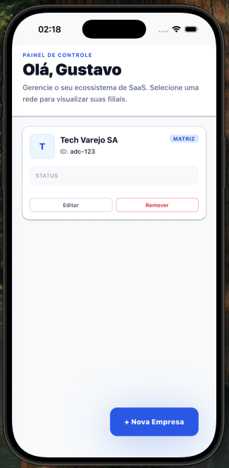
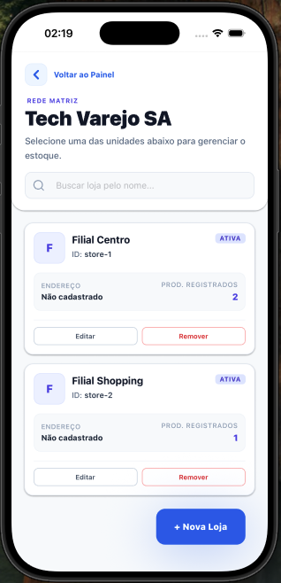
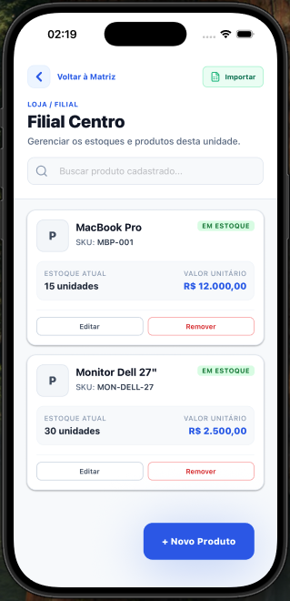
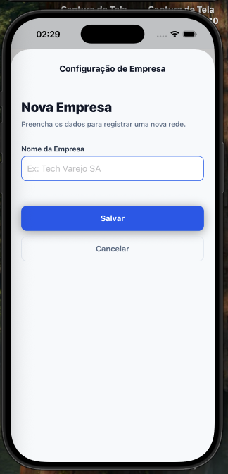
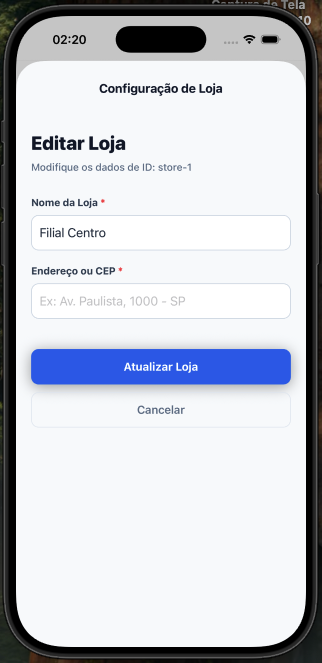
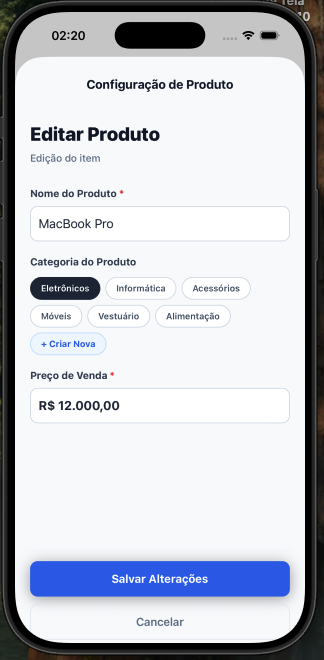

# Controle de Estoque (Controller Stock)

Aplicativo de gerenciamento de filiais e controle de estoque, desenvolvido em React Native com Expo, focado em uma interface moderna e alta performance.

## � Telas do Aplicativo

As imagens abaixo mostram a evolução visual, e os dados dinâmicos do aplicativo:

| Painel Principal | Lista de Lojas | Lista de Produtos |
|:---:|:---:|:---:|
|  |  |  |

| Nova Empresa | Editar Loja | Editar Produto |
|:---:|:---:|:---:|
|  |  |  |

---

## �🛠 Versões Utilizadas

- **Node.js**: v18+ (Recomendado para o ambiente)
- **Expo SDK**: ~54.0.33
- **React**: 19.1.0
- **React Native**: 0.81.5
- **Gerenciamento de Estado (Zustand)**: ^5.0.12
- **Estilização (NativeWind / Gluestack-UI)**: ^4.2.3 / ^3.0.x
- **Mock de Backend (MirageJS)**: ^0.1.48

---

## 🚀 Passos de Instalação e Execução

Caso utilize `pnpm` (conforme o pnpm-lock do projeto), você pode substituir os comandos `npm` por `pnpm`.

1. **Clone o repositório** e acesse a pasta do projeto:
   ```bash
   cd provertec/controler-stock
   ```

2. **Instale as dependências** do projeto:
   ```bash
   npm install
   # ou pnpm install
   ```

3. **Inicie o servidor do Expo**:
   ```bash
   npx expo start
   # ou npm start
   ```

4. **Abra o aplicativo**:
   - Para abrir no seu próprio celular, baixe o aplicativo **Expo Go** (Android/iOS) e escaneie o código QR exibido no terminal.
   - Para rodar em um emulador, pressione no terminal:
     - `a` para rodar no Emulador Android.
     - `i` para rodar no Simulador iOS.

---

## 💾 Instruções para o Mock de Back-end (MirageJS)

Este projeto não depende de uma API externa para funcionar localmente. Ele utiliza o **MirageJS** para interceptar as requisições HTTP e simular um banco de dados relacional (Lojas e Produtos) operando diretamente na memória do aplicativo.

**🚨 Importante:** Você **não precisa** rodar nenhum comando extra para subir o backend. 

### Como funciona:
1. Assim que o aplicativo é inciado (`npx expo start`), o provedor do MirageJS contido na pasta `/mocks/server.ts` é instanciado.
2. Todas as chamadas para `/api/companies`, `/api/stores` e `/api/products` feitas com o `Axios` pelos `Services` são interceptadas.
3. O mock processa a requisição validando `queryParams` (buscas, ids) e gerencia bancos de dados virtuais efêmeros.
4. Para visualizar ou modificar os dados iniciais do projeto (seeds), ou alterar comportamentos de rotas, acesse o diretório `/mocks`.

---


## 🧪 Testes Automatizados

O projeto utiliza o **Jest** configurado com `jest-expo` para validar as principais regras de negócios e a integridade do estado global gerenciado pelo **Zustand**. 

Os testes garantem que as ações fundamentais da aplicação (como modificações, adições e listagens base do _storeStore_) não sofram regressões.

Para executar a suíte de testes unitários, basta rodar o comando na raiz do projeto:

```bash
npm run test
# ou pnpm run test
```
